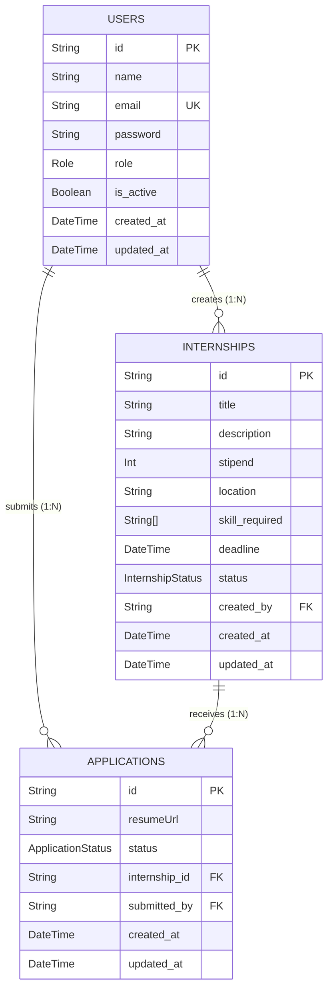

# 🗄️ Database Architecture

This document outlines the data layer of the Internship Recruitment Management System. It includes both the logical Entity-Relationship (ER) model and the physical database schema (Data Dictionary) implemented in PostgreSQL via Prisma.

---

## 1. Entity-Relationship (ER) Diagram
*The logical blueprint defining the business entities and their relationships.*



---

## 2. Physical Database Schema (Data Dictionary)

*The physical implementation details, including strict PostgreSQL data types and constraints.*

### Table: `users`

Acts as the central identity provider for Role-Based Access Control (RBAC).

| Column Name | Data Type | Constraints | Description |
| --- | --- | --- | --- |
| `id` | `UUID / String` | **PRIMARY KEY** | Unique identifier generated upon registration. |
| `name` | `Text` | `NOT NULL` | Full name of the user. |
| `email` | `Text` | `UNIQUE`, `NOT NULL` | Used for authentication. |
| `password` | `Text` | `NOT NULL` | Bcrypt hashed password string. |
| `role` | `Enum (Role)` | `NOT NULL`, Default: `CANDIDATE` | Restricts API access: `ADMIN`, `RECRUITER`, `CANDIDATE`. |
| `is_active` | `Boolean` | `NOT NULL`, Default: `true` | Soft-delete / account suspension flag. |
| `created_at` | `Timestamp` | `NOT NULL`, Default: `now()` | Record creation timestamp. |
| `updated_at` | `Timestamp` | `NOT NULL` | Auto-updates on record modification. |

### Table: `internships`

Stores job postings. Enforces strict resource ownership to the Recruiter who created it.

| Column Name | Data Type | Constraints | Description |
| --- | --- | --- | --- |
| `id` | `UUID / String` | **PRIMARY KEY** | Unique identifier for the job posting. |
| `title` | `Text` | `NOT NULL` | Job title (e.g., "Backend Intern"). |
| `description` | `Text` | `NOT NULL` | Detailed job requirements and responsibilities. |
| `stipend` | `Integer` | `NOT NULL` | Monthly compensation value. |
| `location` | `Text` | `NOT NULL` | City or "Remote". |
| `skill_required` | `Text[]` (Array) | `NOT NULL` | Array of required skills for filtering. |
| `deadline` | `Timestamp` | `NOT NULL` | Last date to accept applications. |
| `status` | `Enum (InternshipStatus)` | `NOT NULL`, Default: `OPEN` | Tracks if the job is `OPEN` or `CLOSED`. |
| `created_by` | `UUID / String` | **FOREIGN KEY** -> `users(id)` | Links the job to the Recruiter who posted it. |
| `created_at` | `Timestamp` | `NOT NULL`, Default: `now()` | Record creation timestamp. |
| `updated_at` | `Timestamp` | `NOT NULL` | Auto-updates on record modification. |

### Table: `applications`

Functions as a junction table connecting a Candidate to a specific Internship.

| Column Name | Data Type | Constraints | Description |
| --- | --- | --- | --- |
| `id` | `UUID / String` | **PRIMARY KEY** | Unique identifier for the application ticket. |
| `resumeUrl` | `Text` | `NOT NULL` | Cloud storage link to the candidate's resume. |
| `status` | `Enum (ApplicationStatus)` | `NOT NULL`, Default: `APPLIED` | Tracks workflow: `APPLIED`, `SHORTLISTED`, `INTERVIEW_SCHEDULED`, `REJECTED`, `SELECTED`. |
| `internship_id` | `UUID / String` | **FOREIGN KEY** -> `internships(id)` | Links the application to the specific job. |
| `submitted_by` | `UUID / String` | **FOREIGN KEY** -> `users(id)` | Links the application to the Candidate. |
| `created_at` | `Timestamp` | `NOT NULL`, Default: `now()` | Submission timestamp. |
| `updated_at` | `Timestamp` | `NOT NULL` | Auto-updates when a recruiter changes the status. |

---

## 3. Referential Integrity Rules

* **User Deletion:** Deleting a `User` will cascade and delete all `Internships` they created and `Applications` they submitted.
* **Internship Deletion:** Deleting an `Internship` will cascade and delete all associated `Applications` to prevent orphan records.

```